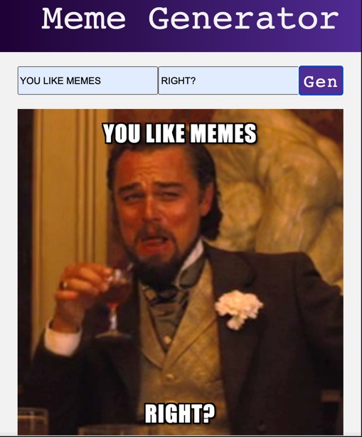
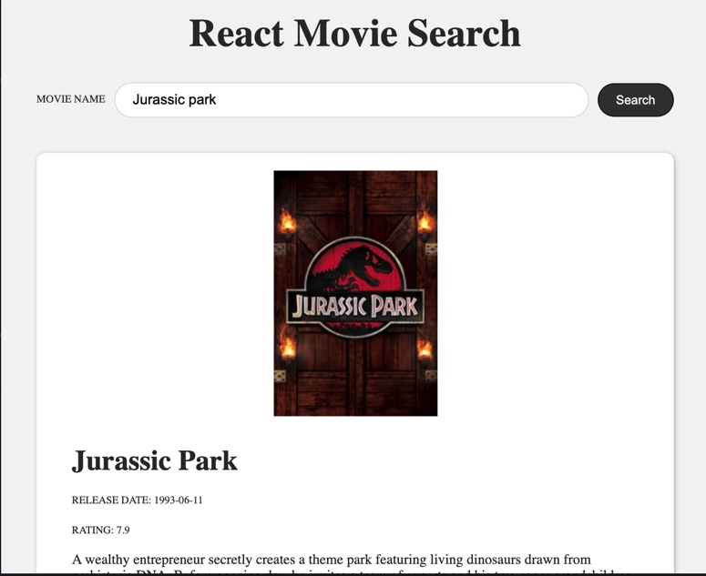

__Tracking of multiple courses on the Scrimba platform__

This is forming the bulk of my practice activities at present while I continue with my University studies.

I am currently working through the React parts of the curriculum. 

Scrimba's educational style suits my current needs due to the constant live practice and challenges, something I feel is lacking in code-along style courses.

__React Meme Generator__

__React Movie Search App__

